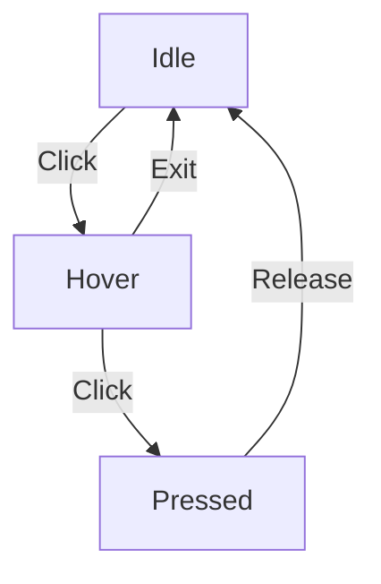

---
# You can also start simply with 'default'
theme: seriph
# random image from a curated Unsplash collection by Anthony
# like them? see https://unsplash.com/collections/94734566/slidev
background: https://rive.app/static/img/features/editor.png
# some information about your slides (markdown enabled)
title: Rive 101
info: |
  Introduction to Rive - Interactive Graphics & Animation Platform
  for Developers and Designers
# apply unocss classes to the current slide
class: text-center
# https://sli.dev/features/drawing
drawings:
  persist: false
# slide transition: https://sli.dev/guide/animations.html#slide-transitions
transition: slide-left
# enable MDC Syntax: https://sli.dev/features/mdc
mdc: true
highlighter: shiki
lineNumbers: false
fonts:
  # Automatically host from Google Fonts
  sans: 'Tomorrow'
  mono: 'Tomorrow'
---

<div class="flex justify-center items-center mb-4">
  
</div>

# Rive 101
The Modern Platform for Interactive Graphics & Animation

<div class="pt-4 text-gray-400">
For Developers & Designers
</div>

<div class="abs-br m-6 flex gap-2">
  <a href="https://rive.app" target="_blank" alt="Rive Website"
    class="text-xl icon-btn opacity-50 !border-none !hover:text-white">
    <carbon:link />
  </a>
  <a href="https://rive.app/docs" target="_blank" alt="Rive Docs"
    class="text-xl icon-btn opacity-50 !border-none !hover:text-white">
    <carbon:document />
  </a>
</div>

---
layout: center
class: text-center
---

# Character Animation from Arcane
## What Rive Can Do - Example 1

<div class="example-showcase">
  <RiveExample
    src="/arcane.riv"
    :width="600"
    :height="400"
    fit="contain"
    alignment="center"
  />
</div>

---
layout: center
class: text-center
---

# Interactive Guitar Character
## What Rive Can Do - Example 2

<div class="example-showcase">
  <RiveExample
    src="/guitargirl.riv"
    :width="600"
    :height="400"
    fit="contain"
    alignment="center"
  />
</div>

---
layout: center
class: text-center
---

# Modern Website Elements
## What Rive Can Do - Example 3

<div class="example-showcase">
  <RiveExample
    src="/technology_website.riv"
    :width="600"
    :height="400"
    fit="contain"
    alignment="center"
  />
</div>

---
layout: center
class: text-center
---

# Advanced Data Visualization
## What Rive Can Do - Example 4

<div class="example-showcase">
  <RiveExample
    src="/advanced_tracker.riv"
    :width="600"
    :height="400"
    fit="contain"
    alignment="center"
  />
</div>

---
layout: center
class: text-center
---

# Reward System Animation
## What Rive Can Do - Example 5

<div class="example-showcase">
  <RiveExample
    src="/how-reward.riv"
    :width="600"
    :height="400"
    fit="contain"
    alignment="center"
  />
</div>

<style>
.example-showcase {
  @apply flex flex-col items-center p-8 rounded-lg border border-gray-400/20;
  max-width: 800px;
  margin: 0 auto;
}

kbd {
  @apply px-2 py-1 text-sm rounded bg-gray-200 dark:bg-gray-800;
}
</style>

---
layout: center
class: text-center
---

# Real-World Applications

<div class="grid grid-cols-3 gap-6 mt-8">
<div v-click class="app-card">
  <carbon:application class="text-4xl mb-4" />
  <h3>Web Apps</h3>
  <ul class="text-sm mt-2 text-left">
    <li>Loading states</li>
    <li>Micro-interactions</li>
    <li>Interactive forms</li>
  </ul>
</div>

<div v-click class="app-card">
  <carbon:game-console class="text-4xl mb-4" />
  <h3>Games</h3>
  <ul class="text-sm mt-2 text-left">
    <li>Character animations</li>
    <li>UI elements</li>
    <li>Menu transitions</li>
  </ul>
</div>

<div v-click class="app-card">
  <carbon:mobile class="text-4xl mb-4" />
  <h3>Mobile Apps</h3>
  <ul class="text-sm mt-2 text-left">
    <li>Onboarding flows</li>
    <li>Animated icons</li>
    <li>Navigation</li>
  </ul>
</div>
</div>

<style>
.app-card {
  @apply p-6 rounded-lg border border-gray-400/20 text-center;
}
.app-card ul {
  @apply list-none;
}
</style>

---
layout: center
---

# The Evolution of Web Animation

<div class="grid grid-cols-2 gap-8">
<div v-click>

### Flash Era (1996-2020)
- Dominated web interactivity
- Rich animation capabilities
- Cross-browser compatibility
- Designer-friendly tools
- Interactive content creation
- Widespread adoption

</div>
<div v-click>

### The End of Flash
- Performance issues
- Security vulnerabilities
- Mobile incompatibility
- Closed ecosystem
- Resource intensive
- Deprecated by browsers

</div>
</div>

<div class="mt-8 text-center text-sm opacity-75" v-click>
Flash revolutionized web animation but couldn't adapt to modern web needs
</div>

---
layout: center
---

# The Modern Solution: Rive

<div class="grid grid-cols-2 gap-12 mt-8">
<div v-click>

### Core Advantages
- Native performance
- Security by design
- Mobile-first approach
- Open standards
- Resource efficient
- Cross-platform support

</div>
<div v-click>

### Technical Improvements
- Vector-based efficiency
- State-driven interactions
- Real-time rendering
- Modern web standards
- Developer-friendly APIs
- Runtime optimization

</div>
</div>

<div class="mt-8 text-center text-sm opacity-75" v-click>
Built from the ground up for modern interactive experiences
</div>

---
layout: center
class: text-center
---

# From Flash to Rive

<div class="grid grid-cols-3 gap-8 mt-8">
<div v-click class="evolution-card">
  <h3 class="text-red-500">Past</h3>
  <div class="mt-4">
    <carbon:flash class="text-4xl mb-4" />
    <p class="text-sm opacity-75">Flash-based animations</p>
    <ul class="text-sm mt-2 text-left">
      <li>Plugin dependent</li>
      <li>Limited mobile support</li>
      <li>Security risks</li>
    </ul>
  </div>
</div>

<div v-click class="evolution-card">
  <h3 class="text-yellow-500">Present</h3>
  <div class="mt-4">
    <carbon:development class="text-4xl mb-4" />
    <p class="text-sm opacity-75">Modern web standards</p>
    <ul class="text-sm mt-2 text-left">
      <li>HTML5 Canvas</li>
      <li>WebGL</li>
      <li>SVG</li>
    </ul>
  </div>
</div>

<div v-click class="evolution-card">
  <h3 class="text-green-500">Future</h3>
  <div class="mt-4">
    
    <p class="text-sm opacity-75">Rive Platform</p>
    <ul class="text-sm mt-2 text-left">
      <li>High performance</li>
      <li>Cross-platform</li>
      <li>Interactive</li>
    </ul>
  </div>
</div>
</div>

<style>
.evolution-card {
  @apply p-6 rounded-lg border border-gray-400/20 text-center;
}
.evolution-card ul {
  @apply list-disc list-inside;
}
</style>

---
layout: image-right
image: https://rive.app/static/img/features/state-machine.png
---

# Why Rive?

<v-clicks>

- 🚀 **High Performance** - 120 FPS vector graphics
- 🎯 **State-Driven** - Interactive animations with logic
- 📱 **Cross-Platform** - One asset, runs everywhere
- 🤝 **Designer-Developer Workflow** - Single source of truth
- 📦 **Small File Size** - Optimized for production
- 🛠 **Runtime Control** - Full programmatic control

</v-clicks>

---
layout: two-cols
---

# Designer Benefits 🎨

<v-clicks>

- Vector design tools similar to Figma/AI
- Familiar timeline animation
- Visual State Machine editor
- Real-time preview
- No coding required
- Asset optimization
- Collaborative workflow

</v-clicks>

::right::

# Developer Benefits 💻

<v-clicks>

- Multiple SDK options:
  - Web/React/Vue/Svelte
  - iOS/Android
  - Flutter/React Native
  - Unity/Unreal
- Small runtime (~100KB gzipped)
- Programmatic control
- Event system
- State management
- Runtime manipulation

</v-clicks>

---
layout: center
class: text-center
---

# Key Features

<div class="grid grid-cols-2 gap-8 mt-8">
<div v-click class="feature-card">
  <carbon:pen-fountain class="text-3xl mb-2" />
  <h3>Vector Graphics</h3>
  <p class="text-sm opacity-75">Resolution independent, small file size</p>
</div>
<div v-click class="feature-card">
  <carbon:flow class="text-3xl mb-2" />
  <h3>State Machine</h3>
  <p class="text-sm opacity-75">Visual programming for interactions</p>
</div>
<div v-click class="feature-card">
  <carbon:movement class="text-3xl mb-2" />
  <h3>Rich Animations</h3>
  <p class="text-sm opacity-75">Timeline, procedural, and physics</p>
</div>
<div v-click class="feature-card">
  <carbon:code class="text-3xl mb-2" />
  <h3>Developer API</h3>
  <p class="text-sm opacity-75">Full programmatic control</p>
</div>
</div>

<style>
.feature-card {
  @apply flex flex-col items-center p-4 rounded-lg border border-gray-400/20;
}
</style>

---
layout: default
---

# Code Examples

<div class="grid grid-cols-2 gap-4">

```ts {all|1-2|4-9|all}
// React Integration
import { useRive } from '@rive-app/react-canvas';

function RiveComponent() {
  const { RiveComponent } = useRive({
    src: 'animation.riv',
    stateMachines: 'state_machine_name',
    autoplay: true
  });

  return <RiveComponent />;
}
```

```dart {all|1-2|4-8|all}
// Flutter Integration
import 'package:rive/rive.dart';

class RiveAnimation extends StatelessWidget {
  @override
  Widget build(BuildContext context) {
    return RiveAnimation.asset('assets/animation.riv');
  }
}
```

</div>

---
layout: center
---

# Live Rive Example

<div class="grid grid-cols-2 gap-4">
<div class="w-full">

### Interactive Animation
Try interacting with this Rive animation:

<RiveExample
  src="/how-reward.riv"
  width="400"
  height="300"
  fit="contain"
  alignment="center"
/>

</div>
<div class="w-full">

```ts
// Vue Integration
import { Rive, Layout } from '@rive-app/canvas';

new Rive({
  canvas: canvasElement,
  src: '/how-reward.riv',
  layout: new Layout({
    fit: 'contain',
    alignment: 'center'
  }),
  autoplay: true
});
```

</div>
</div>

---
layout: center
class: text-center
---

# Use Cases

<div class="grid grid-cols-3 gap-4 mt-4">
<div v-click class="text-center p-4">
  <carbon:application class="text-3xl mb-2" />
  <h3>UI/UX</h3>
  <p class="text-sm opacity-75">Interactive interfaces</p>
</div>
<div v-click class="text-center p-4">
  <carbon:game-console class="text-3xl mb-2" />
  <h3>Games</h3>
  <p class="text-sm opacity-75">Game UI & characters</p>
</div>
<div v-click class="text-center p-4">
  <carbon:mobile class="text-3xl mb-2" />
  <h3>Mobile</h3>
  <p class="text-sm opacity-75">Rich experiences</p>
</div>
</div>

---
layout: center
class: text-center
---

# Getting Started

<v-clicks>

1. Download Rive Editor
2. Choose your platform runtime
3. Create or import assets
4. Add states and animations
5. Export and integrate

</v-clicks>

<div class="pt-12">
  <span @click="$slidev.nav.next" class="px-2 py-1 rounded cursor-pointer" hover="bg-white bg-opacity-10">
    Visit <a href="https://rive.app" target="_blank">rive.app</a> to start <carbon:arrow-right class="inline"/>
  </span>
</div>

---
layout: end
---

# Resources

- 📚 [Documentation](https://rive.app/docs)
- 💬 [Community](https://discord.gg/rive)
- 🎨 [Examples](https://rive.app/community)
- 🛠️ [Runtime SDKs](https://rive.app/runtimes)

<style>
h1 {
  background-color: #2B90B6;
  background-image: linear-gradient(45deg, #4EC5D4 10%, #146b8c 20%);
  background-size: 100%;
  -webkit-background-clip: text;
  -moz-background-clip: text;
  -webkit-text-fill-color: transparent;
  -moz-text-fill-color: transparent;
}

/* New font styles */
:root {
  --slidev-theme-primary: #2B90B6;
  --slidev-font-family-default: 'Tomorrow', sans-serif;
  --slidev-font-family-mono: 'Tomorrow', monospace;
}

.slidev-layout {
  font-family: 'Tomorrow', sans-serif;
}

h1, h2, h3, h4, h5, h6 {
  font-family: 'Tomorrow', sans-serif;
  font-weight: 600;
}

code {
  font-family: 'Tomorrow', monospace;
}
</style>

---
layout: section
---

# Editor Deep Dive

---
layout: two-cols
---

# Design Mode 🎨

<v-clicks>

- Vector design tools
- Pen tool for custom shapes
- Boolean operations
- Gradients & effects
- Asset management
- Nested artboards
- Groups & hierarchy
- Fill & stroke properties

</v-clicks>

::right::

# Animate Mode 🎬

<v-clicks>

- Timeline-based animation
- Keyframe interpolation
- Animation mixing
- Draw order animation
- Custom easing curves
- Animation preview
- Onion skinning
- Animation loops

</v-clicks>

---
layout: default
---

# State Machine Power

<div class="grid grid-cols-2 gap-4">
<div>

### Components

<v-clicks>

- States & Layers
- Input Triggers
- State Transitions
- Blend States
- Exit Time
- Listeners & Events
- Custom Properties
- Logic Flow

</v-clicks>

</div>
<div>

### Example State Machine



</div>
</div>

---
layout: center
---

# Runtime Capabilities

<div class="grid grid-cols-3 gap-6 mt-8">
<div v-click class="feature-card">
  <h3>Performance</h3>
  <ul class="mt-2 text-sm">
    <li>Hardware acceleration</li>
    <li>WebGL rendering</li>
    <li>Memory efficient</li>
    <li>Small runtime size</li>
  </ul>
</div>

<div v-click class="feature-card">
  <h3>Control</h3>
  <ul class="mt-2 text-sm">
    <li>Play/Pause/Stop</li>
    <li>Speed control</li>
    <li>Mix animations</li>
    <li>State management</li>
  </ul>
</div>

<div v-click class="feature-card">
  <h3>Integration</h3>
  <ul class="mt-2 text-sm">
    <li>Multiple platforms</li>
    <li>Framework specific</li>
    <li>Custom rendering</li>
    <li>Event system</li>
  </ul>
</div>
</div>

---
layout: default
---

# Advanced Features

<div class="grid grid-cols-2 gap-8">
<div>

### Constraints & Rigging

<v-clicks>

- IK (Inverse Kinematics)
- Distance constraints
- Rotation constraints
- Scale constraints
- Parent constraints
- Path following
- Bone rigging
- Mesh deformation

</v-clicks>

</div>
<div>

### Special Effects

<v-clicks>

- Clipping masks
- Trim paths
- Vertex deformation
- Draw order animation
- Opacity & blending
- Color overrides
- Custom meshes
- Path manipulation

</v-clicks>

</div>
</div>

---
layout: center
---

# Asset Optimization

<div class="grid grid-cols-2 gap-8 mt-8">
<div v-click>

### File Size Benefits
- Vector-based graphics
- Efficient animation data
- Shared resources
- Compressed assets
- Minimal dependencies

</div>
<div v-click>

### Runtime Benefits
- Memory efficient
- GPU acceleration
- Cached rendering
- Dynamic loading
- Asset preloading

</div>
</div>

---
layout: default
---

# Platform Support

<div class="grid grid-cols-3 gap-4 mt-4">

<div v-click class="platform-card">
  <carbon:application-web class="text-3xl mb-2" />
  <h3>Web</h3>
  <ul class="text-sm mt-2">
    <li>Pure JavaScript</li>
    <li>React</li>
    <li>Vue</li>
    <li>Angular</li>
    <li>WebGL/Canvas</li>
  </ul>
</div>

<div v-click class="platform-card">
  <carbon:mobile class="text-3xl mb-2" />
  <h3>Mobile</h3>
  <ul class="text-sm mt-2">
    <li>iOS (Swift/ObjC)</li>
    <li>Android (Kotlin/Java)</li>
    <li>React Native</li>
    <li>Flutter</li>
    <li>Xamarin</li>
  </ul>
</div>

<div v-click class="platform-card">
  <carbon:game-console class="text-3xl mb-2" />
  <h3>Game Engines</h3>
  <ul class="text-sm mt-2">
    <li>Unity</li>
    <li>Unreal</li>
    <li>Godot</li>
    <li>Bevy</li>
    <li>Custom engines</li>
  </ul>
</div>

</div>

<style>
.platform-card {
  @apply p-4 rounded-lg border border-gray-400/20 text-center;
}
.platform-card ul {
  @apply text-left list-disc list-inside;
}
</style>

---
layout: center
class: text-center
---

# Real World Examples

<div class="grid grid-cols-3 gap-6 mt-8">
<div v-click class="example-card">
  
  <h3>Interactive UI</h3>
  <p class="text-sm opacity-75">Responsive buttons, loaders, and micro-interactions</p>
</div>

<div v-click class="example-card">
  
  <h3>Character Animation</h3>
  <p class="text-sm opacity-75">Game characters, mascots, and avatars</p>
</div>

<div v-click class="example-card">
  
  <h3>Data Visualization</h3>
  <p class="text-sm opacity-75">Animated charts, graphs, and infographics</p>
</div>
</div>

<style>
.example-card {
  @apply p-4 rounded-lg border border-gray-400/20;
}
.example-card img {
  @apply w-full h-32 object-cover;
}
</style>

---
layout: center
class: text-center
---

# Workflow Integration

<div class="grid grid-cols-2 gap-8 mt-8">
<div v-click>

### Design Tools
- Import from Figma
- SVG import/export
- Asset libraries
- Team sharing
- Version control
- Design systems

</div>
<div v-click>

### Development
- CI/CD integration
- Asset optimization
- Runtime debugging
- Performance monitoring
- Testing tools
- Documentation

</div>
</div>

---
layout: end
---

# Rive vs Lottie

<div class="grid grid-cols-2 gap-8">
<div v-click>

### Rive Advantages
- ⚡ **Real-time Rendering** - True runtime performance
- 🎮 **Interactive** - State machines & dynamic control
- 📱 **Cross-platform** - Native runtime performance
- 📦 **Smaller File Size** - Vector-based efficiency
- 🛠 **Runtime Control** - Full programmatic manipulation
- 🔄 **State Management** - Built-in state machines
- 🎨 **Live Editing** - Real-time preview & changes

</div>
<div v-click>

### Lottie Characteristics
- 🎬 **Pre-rendered** - Export-based workflow
- 🖼 **Static** - Limited interactivity
- 🌐 **Web-focused** - Browser-based rendering
- 📊 **JSON Format** - Larger file sizes
- ⚙️ **Limited Control** - Basic playback controls
- 📤 **Export-driven** - After Effects export
- 🔒 **Fixed Content** - Post-export changes limited

</div>
</div>

---
layout: center
---

# Why Choose Rive?

<div class="grid grid-cols-3 gap-6 mt-8">
<div v-click class="comparison-card">
  <h3>Performance</h3>
  <div class="mt-4 text-sm">
    <p>✅ Native runtime performance</p>
    <p>✅ Hardware acceleration</p>
    <p>✅ Smaller file sizes</p>
    <p>✅ Better memory usage</p>
  </div>
</div>

<div v-click class="comparison-card">
  <h3>Interactivity</h3>
  <div class="mt-4 text-sm">
    <p>✅ State machines</p>
    <p>✅ Dynamic properties</p>
    <p>✅ Event system</p>
    <p>✅ Runtime manipulation</p>
  </div>
</div>

<div v-click class="comparison-card">
  <h3>Workflow</h3>
  <div class="mt-4 text-sm">
    <p>✅ All-in-one editor</p>
    <p>✅ Real-time preview</p>
    <p>✅ Version control</p>
    <p>✅ Team collaboration</p>
  </div>
</div>
</div>

<style>
.comparison-card {
  @apply p-6 rounded-lg border border-gray-400/20;
}
.comparison-card h3 {
  @apply text-center text-xl font-semibold;
}
.comparison-card p {
  @apply mb-2;
}
</style>

---
layout: end
---

# Learn More

<div class="grid grid-cols-3 gap-4">
<div v-click>

### Documentation
- [Getting Started](https://rive.app/docs)
- [API Reference](https://rive.app/docs/runtimes)
- [Examples](https://rive.app/examples)
- [Tutorials](https://rive.app/tutorials)

</div>
<div v-click>

### Community
- [Discord Chat](https://discord.gg/rive)
- [GitHub](https://github.com/rive-app)
- [Twitter](https://twitter.com/rive_app)
- [YouTube](https://youtube.com/c/RiveApp)

</div>
<div v-click>

### Resources
- [Blog](https://rive.app/blog)
- [Use Cases](https://rive.app/use-cases)
- [Showcase](https://rive.app/community)
- [Newsletter](https://rive.app/newsletter)

</div>
</div>

<style>
.dark #logosandtypes_com {
  filter: invert(1);
}
</style>
